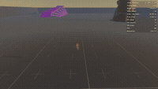

### Hey, Oleks here.

  

I'm a software engineer, I like to build things

- cloud infra development(docker, k8s, GCP, AWS, REST)
- video & audio processing
- 2D/3D rendering, CAD systems
- emdedded devices
- games

